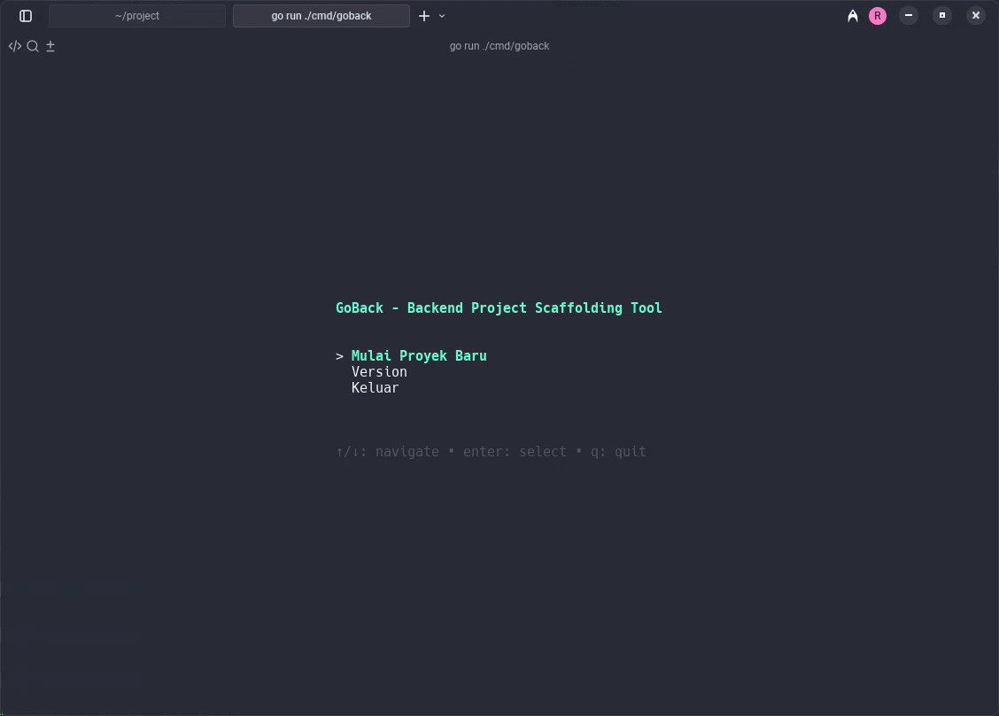

<div align="center">
  <h1>GoBack</h1>
  <p><strong>A TUI-driven Project Scaffolding Tool for Go Backend Services</strong></p>
  <p>Effortlessly generate robust backend project structures with your favorite frameworks, databases, and architectural patterns.</p>
</div>

<div align="center">
    <a href="https://github.com/NarmadaWeb/goback/blob/main/LICENSE">
        
    </a>
    <a href="https://github.com/NarmadaWeb/goback/releases">
        
    </a>
</div>

<br/>

<p align="center">
  
</p>

---

## ✨ Why GoBack?

Tired of manually setting up boilerplate for every new Go backend project? **GoBack** automates the entire process. Built with the elegant **Bubble Tea** framework, it provides a beautiful and intuitive Terminal User Interface (TUI) to configure and generate projects in seconds, letting you focus on writing business logic, not setup code.

## 🚀 Key Features

- **Interactive TUI Mode**: A beautiful, step-by-step terminal interface for effortless project configuration.
- **Powerful CLI Mode**: A fully-featured command-line interface for automation and scripting.
- **Rich Tech Stack**: Mix and match popular frameworks, databases, ORMs, and architectures.
- **DevOps Ready**: Generate CI/CD and infrastructure configuration files for Docker, Kubernetes, and more.
- **Intelligent Scaffolding**: Automatically generates `go.mod`, `Makefile`, `.gitignore`, and a starter `README.md`.
- **Customizable**: Configure default settings and save your preferences for even faster generation.

## 🛠️ Supported Tech Stack

GoBack offers a wide range of options to build your perfect stack:

| Category      | Supported Options                                         |
| :------------ | :-------------------------------------------------------- |
| **Frameworks** | `Fiber`, `Gin`, `Chi`, `Echo`                             |
| **Databases** | `PostgreSQL`, `MySQL`, `SQLite`                           |
| **ORM / Tools** | `GORM`, `SQLC`, `SQLX`                                    |
| **Architecture**| `Simple`, `DDD`, `Clean Architecture`, `Hexagonal`        |
| **DevOps** | `Kubernetes`, `Helm`, `Terraform`, `Ansible`, `Docker`    |

## 📦 Installation

### Prerequisites

- Go 1.23 or higher.
- A terminal that supports 256 colors (recommended for the best TUI experience).

### With `go install` (Recommended)

```bash
go install github.com/NarmadaWeb/goback@latest

# your favorite version
go install github.com/NarmadaWeb/goback@0.1.2 # x.x.x
````

### update version to latest 

```bash
go install -u github.com/NarmadaWeb/goback@latest
````

### From Source

```bash
git clone https://github.com/NarmadaWeb/goback.git

cd goback

go build .

sudo mv goback /usr/local/bin/
```

## ⚡ Quick Start

### Interactive TUI Mode (Recommended)

Simply run the command to launch the interactive TUI.

```bash
goback
# or
goback tui
```

The TUI will guide you through:

1. Selecting your framework, database, and ORM.
2. Choosing an architectural pattern.
3. Optionally adding DevOps tool configurations.
4. Entering your project details.
5. Reviewing your selections and generating the project.

### CLI Mode

For scripting and automation, use the `new` command with flags.

```bash
# Generate a simple Fiber API with PostgreSQL and GORM
goback new my-api \
  --framework fiber \
  --database postgresql \
  --tool gorm \
  --architecture ddd

# See all available flags
goback new --help
```

<details>
<summary><strong>Click to see more CLI examples</strong></summary>

```bash
# Create a Gin API with Clean Architecture and a custom module path
goback new user-service \
  --framework gin \
  --database mysql \
  --tool gorm \
  --architecture clean \
  --module https://github.com/my-org/user-service

# Create a Chi API with full DevOps support
goback new payment-service \
  --framework chi \
  --database postgresql \
  --tool sqlx \
  --architecture hexagonal \
  --devops \
  --devops-tools kubernetes,helm,terraform,ansible,docker
```

</details>

## 🤝 Contributing

Contributions are welcome! Whether it's adding a new feature, fixing a bug, or improving documentation, your help is appreciated.

1. **Fork** the repository.
2. Create a new feature branch (`git checkout -b feature/my-amazing-feature`).
3. Make your changes and commit them (`git commit -m 'feat: Add some amazing feature'`).
4. Push to the branch (`git push origin feature/my-amazing-feature`).
5. Open a **Pull Request**.

Please check our [Contributing Guidelines](CONTRIBUTING.md) and look for issues tagged with `good first issue`.

## 📜 License

This project is licensed under the MIT License. See the [LICENSE](LICENSE) file for details.

## 🙏 Acknowledgments

GoBack is built on the shoulders of giants. Our heartfelt thanks to the creators and maintainers of these amazing libraries:

- [Bubble Tea](https://github.com/charmbracelet/bubbletea) for the TUI framework.
- [Lipgloss](https://github.com/charmbracelet/lipgloss) for terminal styling.
- [Cobra](https://github.com/spf13/cobra) for the powerful CLI.
- [Viper](https://github.com/spf13/viper) for configuration management.

---
<p align="center">
Made with ❤️ by the <a href="github.com/NarmadaWeb">NarmadaWeb</a> team for the Go community.
</p>
